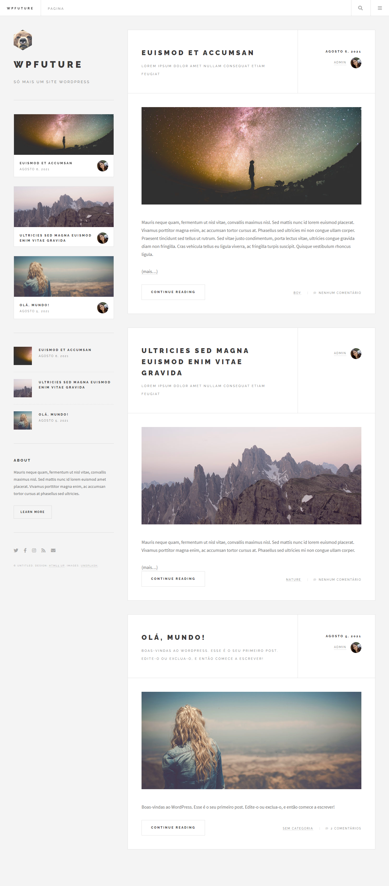

<h1 align="center">
    WP Future
</h1>

<h1 align="center">

  </h1>

# Index

- [About](#-about)
- [Technologies used](#-technologies-used)
- [How to download the project](#-how-to-download-the-project)

## 🔖&nbsp; About

The WP Future is a project created project created to practice converting a static page to a dynamic WordPress theme.

---

## 🚀 Technologies used

The project was developed using the following technologies

- Semantic HTML5 markup
- CSS custom properties
- PHP
- WordPress
- VS Code

---

## 🗂 How to download the project

    - Clone the repository
    - Enter directory
    - Install dependencies
    - Start project
   
---

Developed ❤ by Juliana Fernandez

